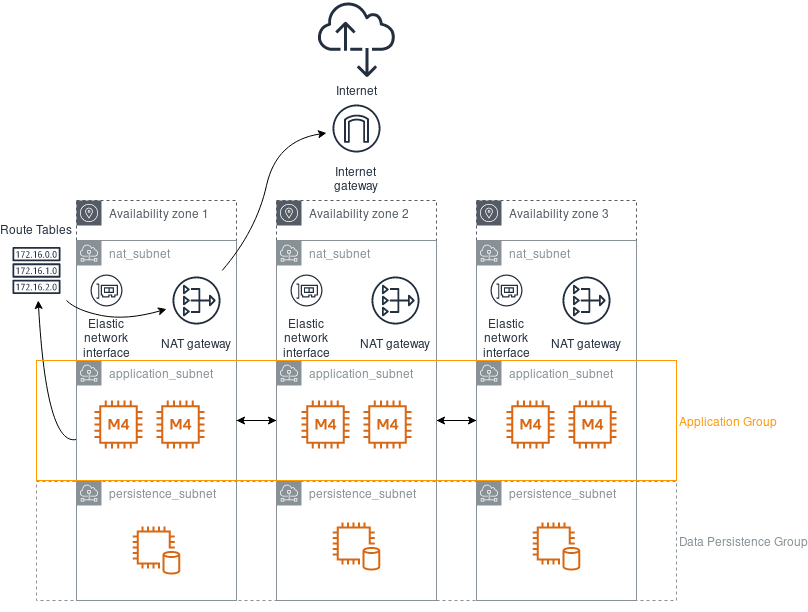

# Network Module

## Description
This module provides a fully operative VPC, and a set of subnets (private and public).

This module provisions:
*   A VPC with Internet Gateway
*   A set of Public Subnets with NAT Gateway and Elastic IPs.
*   A set of Private Subnets for Application and Persistence.
*   Route Tables for each Availability Zone (Routing Trafic through Internet)

This module has been written using Terraform `0.12.6`.